**PARTIE COMMUNE**
==================
	
	_Header: -images en banniere cliquable(redirige vers l'acceuil)

	_Menu lateral: -7 liens cliquables précédés d'une image commune menant sur les différente page à coder.
				   -Un titre 	
				   -20 liens cliquables précédé d'une image commune qui ne doivent mener nul part.  	 

	_Footer : -5 liens du menu (screen à suivre);
			  - 3 liens: -Facebook
			  			 -Twitter
			  			 -Beerlinked
			  			 (Les trois précédés de l'image correspondante au site ciblé)	

	Voir screen Menu:
	
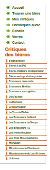		

**PAGE 1: ACCEUIL**
====================
	
	_6 images;
	_2 boutons (non fonctionnels):-Facebook
				                  -Twitter

	_12 liens internes, 1 sous chaque image et seulement les trois premiers fonctionnels;
	
	_Contenu textuel: -texte de bienvenue;
					  -Explications partielles sous chaque bière;

	Voir screen: 

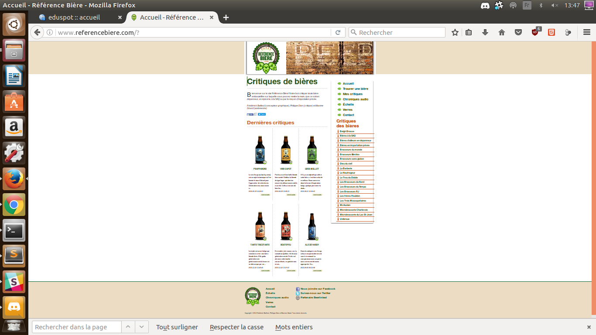

**PAGE 2: RECHERCHE**
=====================

	_Un formulaire: -Un champ "Recherche par biere"
					-un tableau	contenant 6 champs de recherche à choix multiples( <select>)

	Voir screen:

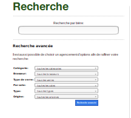

**PAGE 3: CRITIQUE**
====================

	_Un formulaire bouton : -Login Facebook
							-Lien externe (preivate policies)

	screen :

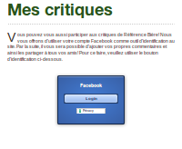	

**PAGE 4: CHRONIQUE AUDIO**
===========================

	_13 liens déroulants (JS) amenant chacun à une explication et un lien cliquable amenant vers l'exterieur
	_Un titre "CIBL CHAPEAU"
	_8 liens déroulants amenants chacun ver une explication et une vidéo.

	screen:

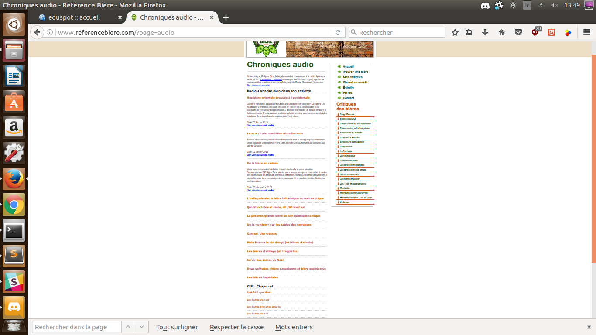
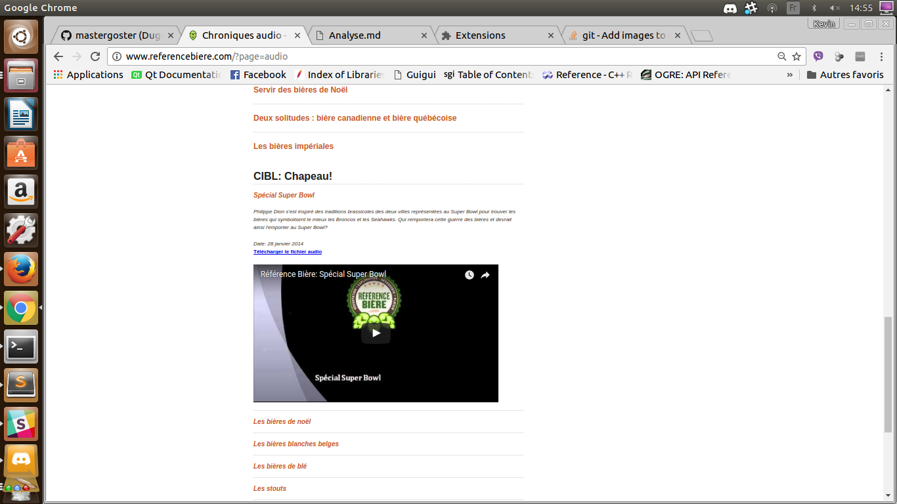

**PAGE 5: ECHELLE**
===================
	_Contenu textuel
	_10 images

	screen:

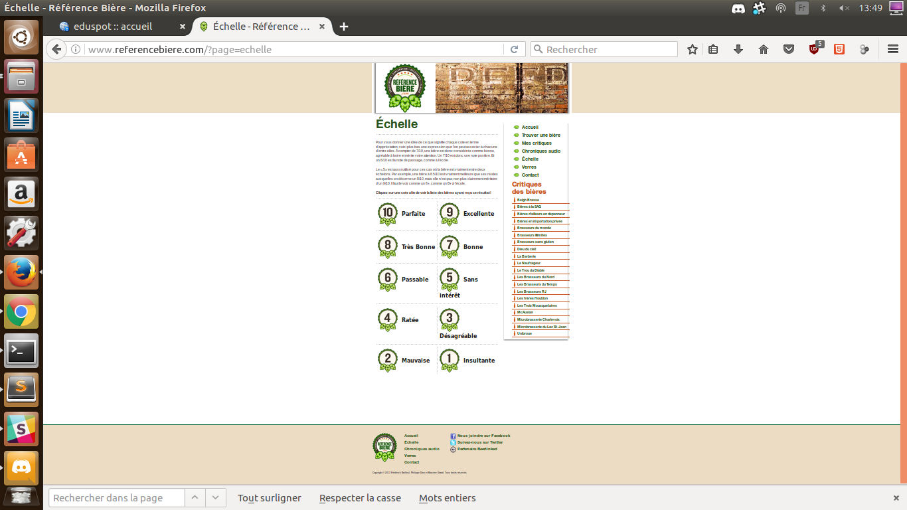	

**PAGE 6: VERRE**
=================

	_Contenu textuel
	_7 images cliquable qui ne doivent mener nul part;
	_Des explications sous chaque image

	screen:

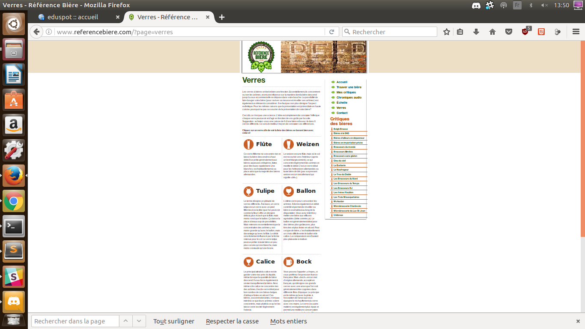
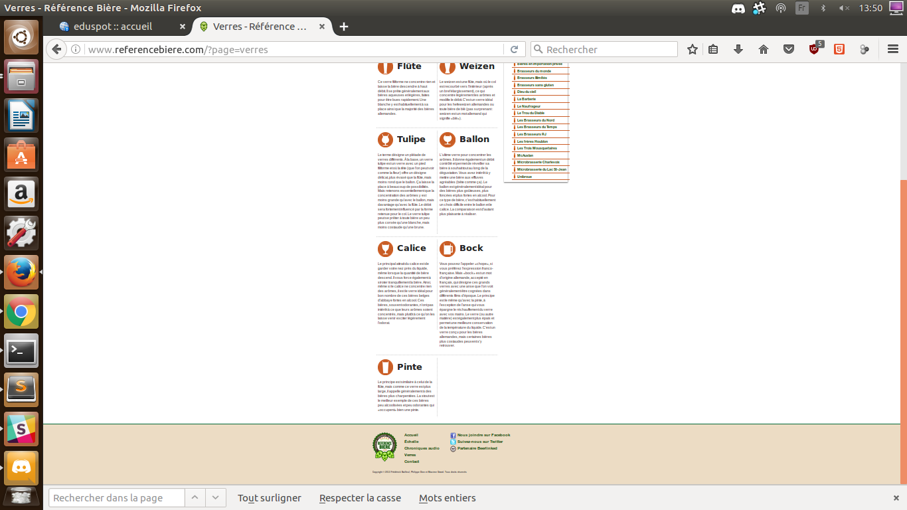

**PAGE 7: CONTACT**
===================

	_6 liens
	_4 images(chaque image à son explications)

	screen:

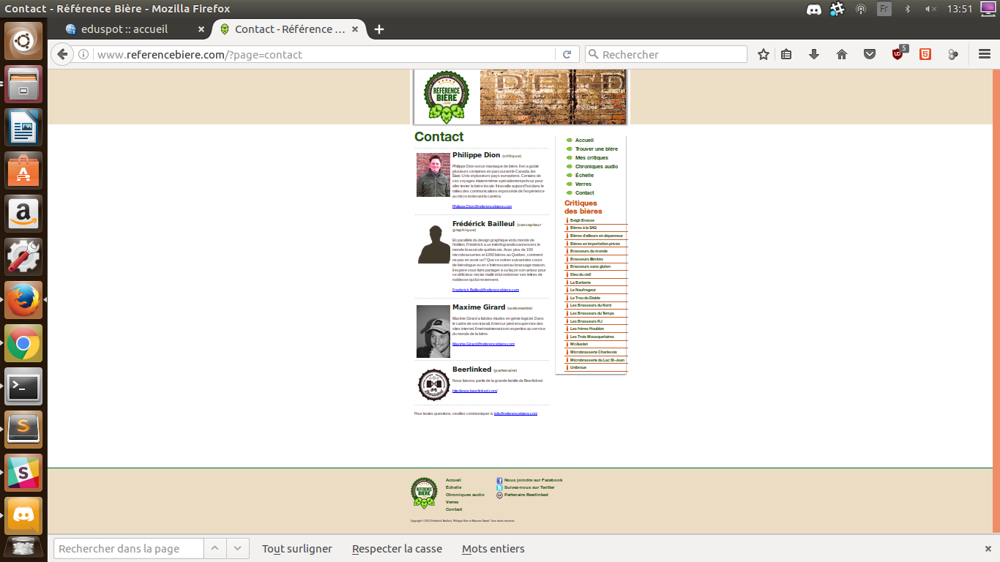	

**PAGE Frappa Bord**
		_5 images
		_3 boutons
		_image biere effet css hover grossissant

**PAGE Vire Capot**
		_5 images
		_3 boutons
		_image biere effet css hover grossissant

**PAGE Gros mollet**
		_5 images
		_3 boutons
		_image biere effet css hover grossissant

	screen:

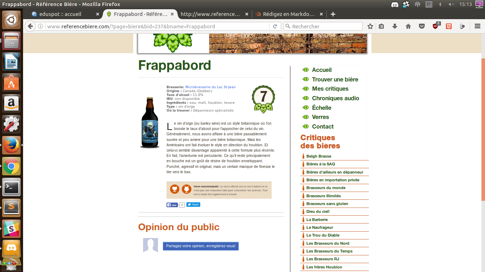
	

